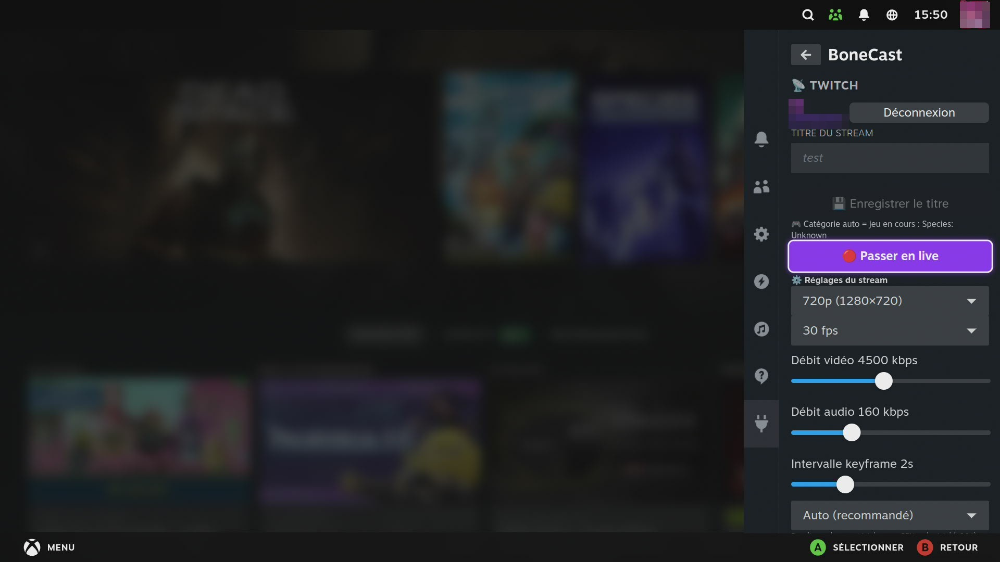

# BoneCast 🦴📡

**Twitch en Mode Jeu Steam** — un plugin [Decky Loader](https://github.com/SteamDeckHomebrew/decky-loader) pour Steam Deck / Bazzite / SteamOS.

🌍 **Langues :** [English](../README.md) · **Français** · [Deutsch](README.de.md) · [Español](README.es.md) · [Italiano](README.it.md) · [Português](README.pt.md) · [Nederlands](README.nl.md) · [Polski](README.pl.md) · [Русский](README.ru.md)

> Fait partie de la suite de plugins Necrosiak, aux côtés de
> [SkullKey](https://github.com/Necrosiak/SkullKey),
> [Steamcord](https://github.com/Necrosiak/Steamcord) et BC250-Toolkit.
> L'interface du plugin est traduite en 9 langues et suit automatiquement la langue de SteamOS.

---

## Ce que ça fait

BoneCast met tout ce qu'il faut pour streamer sur **Twitch** directement dans le **Menu d'accès rapide** de Steam — sans bureau, sans clavier, pensé pour la manette du login jusqu'au passage en live.

- **Une seule connexion Twitch** *(code d'appareil — compatible manette)* : tu saisis un code court sur `twitch.tv/activate`, et BoneCast récupère ta **clé de stream automatiquement**. Plus jamais de copier-coller.
- **Passe en live depuis le QAM** — un bouton démarre et arrête le flux RTMP. Un badge **● EN DIRECT** s'affiche pendant la diffusion.
- **Titre du stream modifiable** — défini depuis le plugin, changeable **même en direct**.
- **Catégorie de jeu automatique** — lue depuis le jeu Steam en cours (fonctionne aussi pour les raccourcis non-Steam) et mise à jour à la volée. Repli sur *Just Chatting* quand un jeu n'a pas de catégorie Twitch correspondante.
- **Overlay de chat transparent** — le chat Twitch en lecture seule dessiné **par-dessus le jeu** en Mode Jeu (plan external-overlay de gamescope), avec les émotes natives + **BTTV / 7TV / FFZ**. Position, taille et opacité se règlent en direct depuis le QAM, et il reste visible même quand Big Picture a le focus.
- **🎬 Clips instantanés** — en live, un bouton clippe les ~30 dernières secondes via l'API Twitch ; le clip arrive sur ton tableau de bord environ 15 secondes plus tard.
- **💬 Parle dans ton propre chat** — envoie des messages dans ton chat Twitch directement depuis le QAM, sans gymnastique clavier-sur-bureau.
- **⏸️ Mode BRB** — un appui remplace l'image du jeu par un écran de pause propre et coupe ton micro ; un appui te ramène. Le stream ne coupe jamais.
- **⏺️ Enregistrement local** — sauvegarde ta session en MKV dans `~/Vidéos/BoneCast/`, en parallèle du live ou **sans streamer du tout** (aucune clé de stream impliquée).
- **Coupure micro en direct** — coupe ton micro **sur le stream** d'un seul appui, sans arrêter la diffusion (et sans couper ton vocal Discord).
- **Réglages de stream par compte** — résolution, fps, débit vidéo/audio, intervalle d'image-clé, et un **encodeur auto-détecté** (NVENC ▸ VAAPI ▸ x264 logiciel). Seuls les encodeurs qui marchent réellement sur ton matériel sont proposés.
- **Pont audio Discord** *(si [Steamcord](https://github.com/Necrosiak/Steamcord) est installé)* : une case optionnelle mixe ta **voix Discord** dans le stream, pour que ton groupe soit entendu des spectateurs — tout en continuant à les entendre normalement.

---

## Comment ça marche

Twitch n'a pas d'API de push vidéo, donc passer en live implique toujours un **push RTMP** en coulisses. BoneCast s'en occupe pour toi :

1. Le **flux OAuth par code d'appareil** te connecte à Twitch et récupère ta clé de stream, ton titre et ta catégorie via l'API Helix — tu ne touches jamais à la clé.
2. L'image du jeu est capturée depuis **gamescope** vers un périphérique de bouclage `v4l2`, puis **ffmpeg** l'encode (matériel si disponible, logiciel `libx264` sinon) et la pousse vers `rtmp://…/<ta-clé>`.
3. L'**overlay de chat** est une surface WebKit transparente promue sur le plan external-overlay de gamescope, qui lit l'IRC Twitch de façon anonyme et affiche les émotes.

Tout se pilote depuis le QAM et survit aux redémarrages.

---

## 📸 Captures d'écran

  

## Installation

1. Installe [Decky Loader](https://github.com/SteamDeckHomebrew/decky-loader).
2. Active le **Mode développeur** dans les réglages généraux de Decky, puis réglages Decky → **Développeur** → *Installer un plugin depuis une URL* :
   `https://github.com/Necrosiak/BoneCast/releases/latest/download/BoneCast.zip`
   (ou récupère `BoneCast.zip` sur la page des [Releases](https://github.com/Necrosiak/BoneCast/releases) et installe depuis le ZIP).
3. Ouvre le **Menu d'accès rapide → BoneCast**, connecte-toi à Twitch, et passe en live.

BoneCast **se met à jour automatiquement** depuis les Releases GitHub (activable dans la section *Mises à jour* du plugin).

---

## 🐧 Compatibilité

BoneCast vise **toutes les distributions Linux** capables de lancer Steam en
Mode Jeu / Big Picture : un seul build, détection à l'exécution de tout ce qui
est externe (ffmpeg, libx264, v4l2loopback, GStreamer), et la commande
d'installation exacte pour ton gestionnaire de paquets affichée dans le QAM
quand quelque chose manque.
Notes de paquets par distribution : [OS-NOTES.md](OS-NOTES.md).

## 🐛 Bugs & idées — n'hésite pas !

Un bug, un comportement bizarre sur ta distribution, ou une fonctionnalité qui
manque ? **Ouvre une [issue](https://github.com/Necrosiak/BoneCast/issues)** —
chaque signalement oriente directement ce qui sera construit ensuite. Si tu
peux, indique :

- ta distribution & version (Bazzite 42, CachyOS, Ubuntu 24.04…) et ton GPU (pour les sondes d'encodeur)
- la version du plugin et ce que tu faisais (passage en live, overlay, OAuth…)
- ce que tu attendais vs ce qui s'est passé
- les logs : `~/homebrew/logs/BoneCast/`

Les demandes de fonctionnalités et les retours « ça marche ! » sur des configs
inhabituelles sont tout aussi précieux.

## Crédits

Créé et maintenu par **Necrosiak**. Fait partie de la suite de plugins Necrosiak pour le Mode Jeu Steam.
