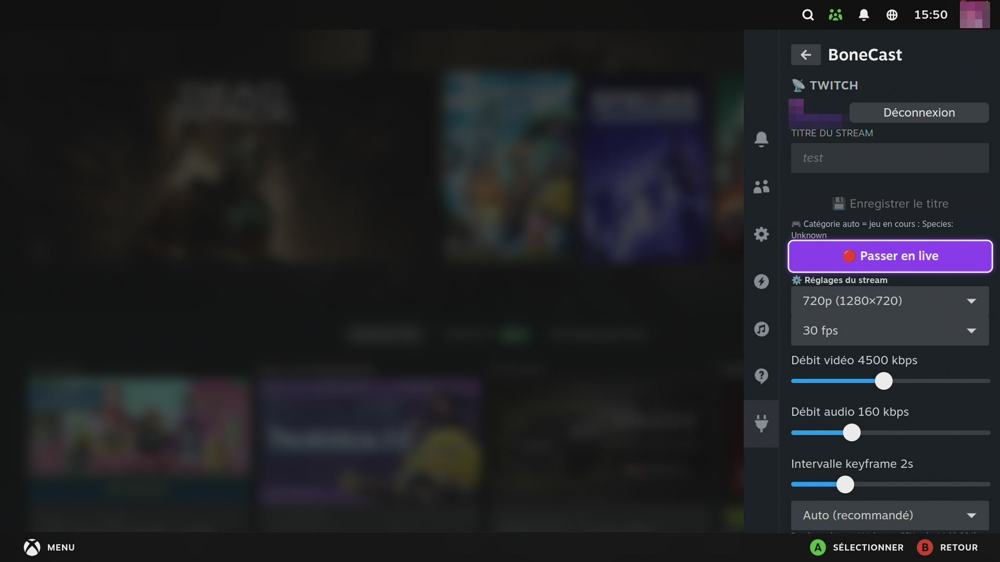

# BoneCast 🦴📡

**Nowość w v0.5.4:** powiadomienia o aktualizacji można otworzyć w Steam. Okno dostosowane do kontrolera pokazuje szczegóły, a przy błędzie link do wydania.

**Twitch i YouTube w Trybie Gry Steam** — wtyczka [Decky Loader](https://github.com/SteamDeckHomebrew/decky-loader) dla Steam Deck / Bazzite / SteamOS.

🌍 **Języki:** [English](../README.md) · [Français](README.fr.md) · [Deutsch](README.de.md) · [Español](README.es.md) · [Italiano](README.it.md) · [Português](README.pt.md) · [Nederlands](README.nl.md) · **Polski** · [Русский](README.ru.md)

> Część pakietu wtyczek Necrosiak, obok
> [SkullKey](https://github.com/Necrosiak/SkullKey),
> [Steamcord](https://github.com/Necrosiak/Steamcord) i BC250-Toolkit.
> Interfejs wtyczki jest przetłumaczony na 9 języków i automatycznie podąża za językiem SteamOS.

---

## Co robi

BoneCast umieszcza wszystko, czego potrzebujesz do streamowania na **Twitch**, bezpośrednio w **Menu szybkiego dostępu** Steam — bez pulpitu, bez klawiatury, w pełni obsługiwane padem od logowania aż po wejście na żywo.

- **Jedno logowanie do Twitcha** *(kod urządzenia — przyjazny padowi)*: wpisujesz krótki kod na `twitch.tv/activate`, a BoneCast pobiera Twój **klucz streamowania automatycznie**. Nigdy więcej ręcznego kopiowania.
- **▶️ Karta YouTube** *(nowość w 0.4.0)* — nadawaj na YouTube za pomocą klucza transmisji, z **własnymi ustawieniami** (rozdzielczość, bitrate, enkoder, mikrofon, dźwięk Discorda, nagrywanie), ekranem pauzy i wyciszaniem mikrofonu na żywo, a do tego **nakładka czatu YouTube** na grze, bez konta. Zawsze tylko jedna transmisja i jedna nakładka czatu: Twitch i YouTube nigdy nie działają razem. **Nowość w 0.5.0:** zaloguj się kontem YouTube (kod na `google.com/device`), a BoneCast utworzy transmisję za Ciebie, z tytułem, widocznością i własnym czatem z QAM, bez klucza transmisji. Wybierz opóźnienie transmisji (normalne, niskie lub bardzo niskie) *(0.5.1)*.
- **Wejdź na żywo z QAM** — jeden przycisk uruchamia i zatrzymuje strumień RTMP. Podczas nadawania widoczna jest plakietka **● NA ŻYWO**.
- **Edytowalny tytuł streamu** — ustawiany z wtyczki, zmienialny **nawet w trakcie transmisji**.
- **Automatyczna kategoria gry** — odczytywana z uruchomionej gry Steam (działa też dla skrótów spoza Steam) i aktualizowana na bieżąco. Gdy gra nie ma pasującej kategorii Twitcha, używane jest *Just Chatting*.
- **Przezroczysta nakładka czatu** — czat Twitcha (tylko do odczytu) rysowany **nad grą** w Trybie Gry (warstwa external-overlay gamescope), z emotkami natywnymi + **BTTV / 7TV / FFZ**. Pozycję, rozmiar i przezroczystość ustawiasz na żywo z QAM, a nakładka pozostaje widoczna nawet gdy Big Picture ma fokus. Suby, rajdy i bitsy (Twitch), Super Chaty i nowi członkowie (YouTube) pojawiają się jako wyróżnione karty *(0.5.0)*.
- **📺 Oglądaj Twitcha nad grą** — do **czterech transmisji** wyświetlanych nad grą w Trybie gry. Twoje **obserwowane kanały na żywo** są na liście z miniaturą i liczbą widzów: dotknij i transmisja rusza. Układ, rozmiar, krycie i liczbę klatek ustawiasz w QAM; wybierasz, **czyj dźwięk** słyszysz, z osobną głośnością, zawsze na domyślnym wyjściu audio. *(Obserwowane kanały wymagają jednorazowego ponownego połączenia z Twitchem po aktualizacji, aby nadać nowe uprawnienie.)*
- **🎬 Błyskawiczne klipy** — podczas transmisji jeden przycisk wycina ostatnie ~30 sekund przez API Twitcha; klip pojawia się na Twoim panelu po około 15 sekundach.
- **💬 Pisz na własnym czacie** — wysyłaj wiadomości na swój czat Twitcha prosto z QAM, bez żonglowania klawiaturą nad pulpitem.
- **⏸️ Tryb BRB** — jedno naciśnięcie zastępuje obraz gry czystym ekranem pauzy i wycisza mikrofon; kolejne przywraca grę. Transmisja nigdy się nie zrywa. **Własny ekran pauzy** *(0.5.0)*: w trybie pulpitu umieść obraz o nazwie `brb.png` w folderze `BoneCast-BRB` w folderze domowym. Także animowany *(0.5.1)*: `brb.mp4`, `brb.webm` lub `brb.gif`, w pętli.
- **⏺️ Nagrywanie lokalne** — zapisz sesję jako MKV w `~/Wideo/BoneCast/`, równolegle do transmisji na żywo lub **w ogóle bez streamowania** (bez udziału klucza streamowania). Zapisuj w pamięci wewnętrznej, na karcie SD lub na dysku zewnętrznym *(0.5.1)*.
- **Wyciszanie mikrofonu na żywo** — wytnij mikrofon **na streamie** jednym naciśnięciem, bez zatrzymywania transmisji (i bez wyciszania rozmowy na Discordzie).
- **Ustawienia streamu per konto** — rozdzielczość, fps, bitrate wideo/audio, interwał klatek kluczowych oraz **automatycznie wykrywany enkoder** (NVENC ▸ VAAPI ▸ programowy x264). Proponowane są tylko enkodery, które naprawdę działają na Twoim sprzęcie.
- **Most audio Discorda** *(gdy zainstalowany jest [Steamcord](https://github.com/Necrosiak/Steamcord))*: opcjonalny przełącznik miksuje Twój **głos z Discorda** do streamu, dzięki czemu widzowie słyszą Twoją drużynę — a Ty nadal słyszysz ją normalnie.

---

## Jak to działa

Twitch nie ma API do wypychania wideo, więc wejście na żywo zawsze oznacza **push RTMP** pod spodem. BoneCast zajmuje się tym za Ciebie:

1. **Przepływ OAuth z kodem urządzenia** loguje Cię do Twitcha i pobiera klucz streamowania, tytuł i kategorię przez API Helix — nigdy nie dotykasz klucza.
2. Obraz gry jest przechwytywany z **gamescope** i przekazywany bezpośrednio do **ffmpeg** przez potok (bez wirtualnej kamery, nic do instalowania), który go koduje (sprzętowo, gdy to możliwe, programowo `libx264` w przeciwnym razie) i wysyła do `rtmp://…/<twój-klucz>`.
3. **Nakładka czatu** to przezroczysta powierzchnia WebKit wyniesiona na warstwę external-overlay gamescope, która anonimowo czyta IRC Twitcha i renderuje emotki.

Wszystkim steruje się z QAM i wszystko przeżywa restarty.

---

## 📸 Zrzuty ekranu

  

## Instalacja

1. Zainstaluj [Decky Loader](https://github.com/SteamDeckHomebrew/decky-loader).
2. Włącz **Tryb dewelopera** w ogólnych ustawieniach Decky, następnie ustawienia Decky → **Deweloper** → *Zainstaluj wtyczkę z adresu URL*:
   `https://github.com/Necrosiak/BoneCast/releases/latest/download/BoneCast.zip`
   (albo pobierz `BoneCast.zip` ze strony [Releases](https://github.com/Necrosiak/BoneCast/releases) i zainstaluj z pliku ZIP).
3. Otwórz **Menu szybkiego dostępu → BoneCast**, zaloguj się do Twitcha i wejdź na żywo.

BoneCast **aktualizuje się automatycznie** z GitHub Releases (do wyłączenia w sekcji *Aktualizacje* wtyczki).

---

## 🐧 Kompatybilność

BoneCast celuje w **każdą dystrybucję Linuksa**, która potrafi uruchomić Steam
w Trybie Gry / Big Picture: jeden build, wykrywanie w czasie działania
wszystkiego, co zewnętrzne (ffmpeg, libx264, GStreamer), oraz
dokładne polecenie instalacji dla Twojego menedżera pakietów wyświetlane w
QAM, gdy czegoś brakuje. Uwagi o pakietach per dystrybucja:
[OS-NOTES.md](OS-NOTES.md).

## 🐛 Błędy i pomysły — nie wahaj się!

Znalazłeś błąd, coś dziwnie działa na Twojej dystrybucji albo brakuje funkcji?
**Otwórz [issue](https://github.com/Necrosiak/BoneCast/issues)** — każde
zgłoszenie bezpośrednio kształtuje to, co powstanie dalej. Jeśli możesz,
podaj:

- swoją dystrybucję i wersję (Bazzite 42, CachyOS, Ubuntu 24.04…) oraz GPU (dla sond enkodera)
- wersję wtyczki i co robiłeś (wejście na żywo, nakładka, OAuth…)
- czego oczekiwałeś, a co się stało
- logi: `~/homebrew/logs/BoneCast/`

Prośby o funkcje i zgłoszenia „działa!" na nietypowych konfiguracjach są
równie cenne.

## Autorzy

Stworzone i utrzymywane przez **Necrosiak**. Część pakietu wtyczek Necrosiak dla Trybu Gry Steam. Podziękowania dla [dreemur-e](https://github.com/dreemur-e) za testy na Steam Deck OLED, pomysły do YouTube i strażnika przechwytywania, który usunął zamrożony obraz ([#1](https://github.com/Necrosiak/BoneCast/issues/1)).

## Informacja o AI

Przy tworzeniu tego projektu korzystano z AI (Claude od Anthropic i Codex od OpenAI) — do inżynierii wstecznej, programowania i dokumentacji. **Nie** do grafiki ani twórczego pisania. Wszystko, co publikowane, przechodzi przez człowieka, a za wynik odpowiadam ja. Jeśli ci to nie odpowiada, teraz już wiesz.

## Wesprzyj rozwój

Jeśli ten projekt jest dla Ciebie przydatny, możesz wesprzeć jego dalszy rozwój na [Ko-fi](https://ko-fi.com/nekyron).

